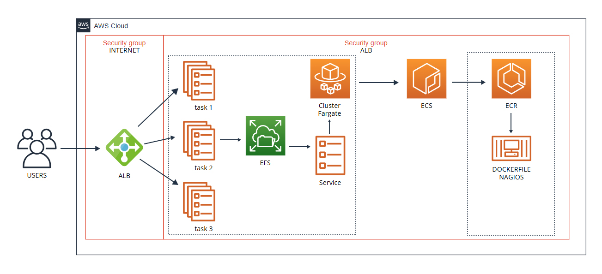

## 🚀 Implementación de Nagios Core en AWS con ECR y ECS "Fargate"

Este repositorio detalla el proceso de despliegue de una imagen personalizada de **Nagios Core** en **Amazon ECS (Fargate)**, con persistencia de datos mediante **EFS** y disponibilidad mediante un **Application Load Balancer (ALB)**. Se utiliza una imagen Docker propia construida y publicada desde repositorio Principal en GitHub.

---

## 📌 Diagrama de la Infraestructura

---

## 🧱 Flujo de implementación en AWS

1. **Dockerización del servicio**
   - Se construyó una imagen personalizada de Nagios Core 4.4.14 en base a Debian.
   - Se configuraron usuarios, plugins, Apache con CGI y autenticación básica.
   - El contenedor expone `/opt/nagios/etc` y `/opt/nagios/var` como volúmenes.

2. **Repositorio GitHub**
   - El código fuente del Dockerfile fue almacenado en [MyProyect GitHub](https://github.com/dzchr/MyProyect).
   - Se agregó documentación de uso, construcción y estructura del repositorio.

3. **Carga a Amazon ECR**
   - Se construyó la imagen localmente con `docker build -t nagios-core .`.
   - Se subió a ECR: `docker tag` + `docker push`.

4. **Creación de recursos AWS**
   - ✅ **Security Groups (SG):**
     - `SG_Dz` para el ALB (permite tráfico HTTP).
     - `SG_ALB` para las tareas Fargate (permite comunicación con ALB y EFS).
   - ✅ **EFS**:
     - Volumen creado con Access Point.
     - Montado en `/opt/nagios/var` para persistencia de datos.
   - ✅ **Cluster ECS y Task Definition:**
     - Configuración de la tarea con volumen EFS montado.
     - Definición del contenedor con la imagen de ECR.
   - ✅ **Servicio ECS + ALB:**
     - Servicio configurado con 3 tareas replicadas.
     - ALB público que enruta tráfico a `/nagios`.

---

## 🌐 Acceso público al servicio

**URL de monitoreo Nagios:**

> [http://nagios-alb-990900639.us-east-1.elb.amazonaws.com/nagios](http://nagios-alb-990900639.us-east-1.elb.amazonaws.com/nagios)

---

## ✅ Estado actual del despliegue

| Componente      | Estado       | Detalles                        |
|-----------------|--------------|---------------------------------|
| Imagen Docker   | ✅ Listo     | Versión 1.0                     |
| GitHub Repo     | ✅ Listo     | Contiene Dockerfile y docs     |
| ECR             | ✅ Activo    | Imagen cargada y pública       |
| ECS Cluster     | ✅ Corriendo | Fargate con 3 tareas activas   |
| EFS             | ✅ Montado   | Persistencia funcional         |
| ALB             | ✅ Accesible | Verificado y balanceando carga |

## 📌 Repositorio principal con Imagen Nagios

### [https://github.com/dzchr/MyProyect](https://github.com/dzchr/MyProyect)
